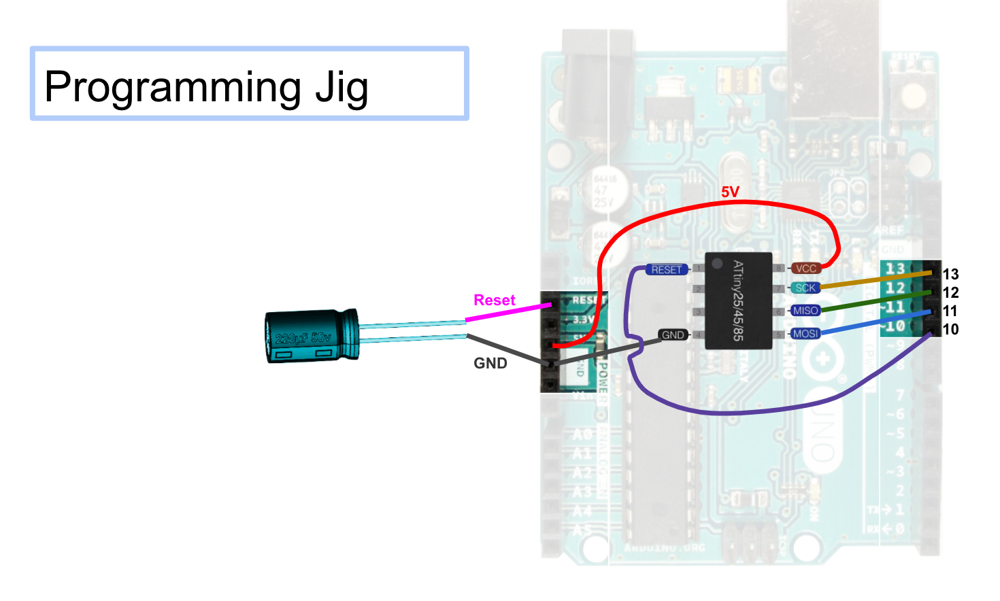
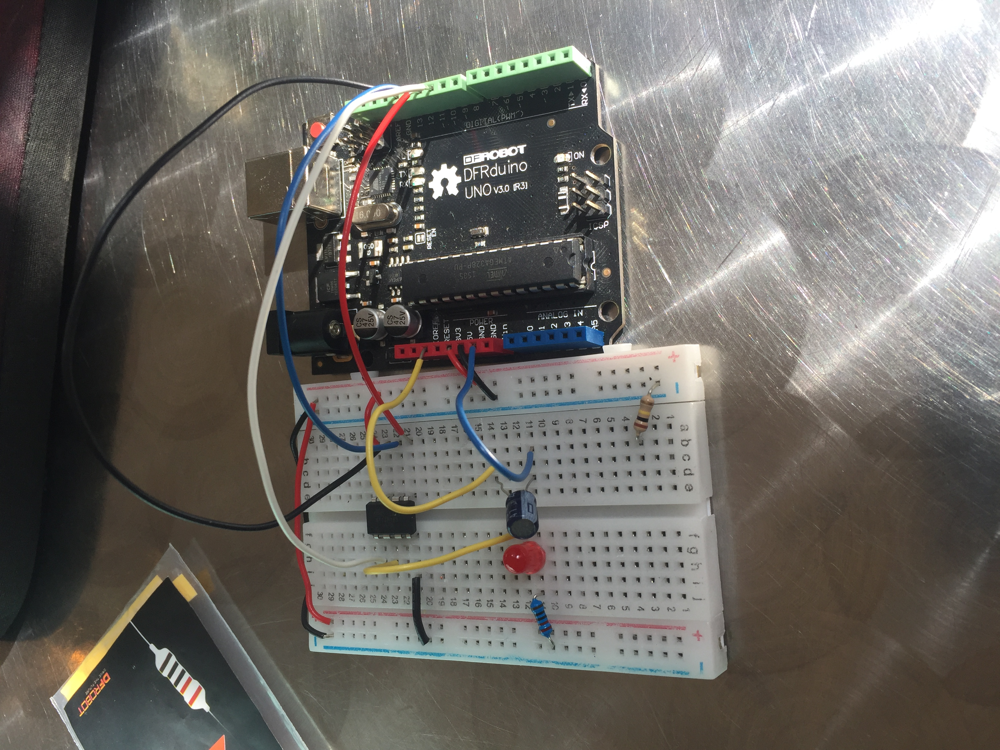
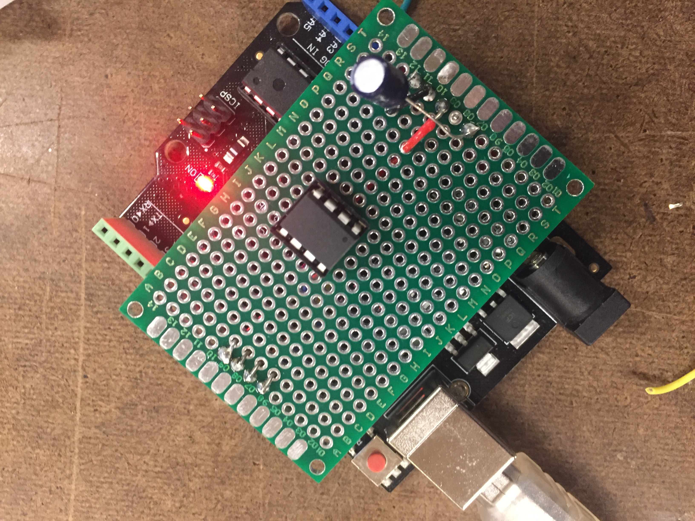

# ATTiny85 Programming Rig

As our first exercise we were supposed to create a programming rig for the ATtiny85 

This is extremely useful because it provides a quick and easy method for programming these microcontrolers with only an arduino and our rig. Below is the basic schematic of how we need to wire the Arduino Uno up to the ATtiny85 in order to communicate through SPI and burn the bootloader. Notice that we connect reset and ground in order to circumvent the arduino from reseting itself during the process.  

Initially I wired up the system on a breadboard in order to ensure I had the circuitry correct. Here is what it looked like on the breadboard.

I then soldered all of this wiring onto a circuit board with male headers to plug in directly to the Arduino. This basically a programming shield for the ATtiny85 which plugs directly into our arduino. 

Using soldering boards like this allow us to quickly prototype circuitry on an easy to manage interface. Additionally, it is almost a blown up verson of what we will be making once we start milling our own PCB boards. 

