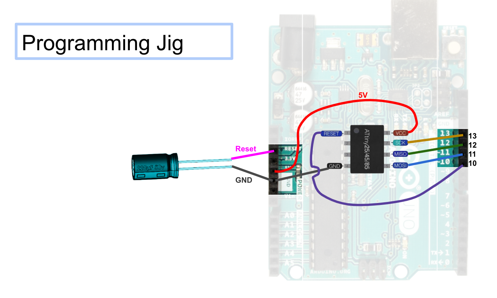

As our first exercise we were supposed to create a programming rig for the ATtiny85 

This is extremely useful because it provides a quick and easy method for programming these microcontrolers with only an arduino and our rig.

