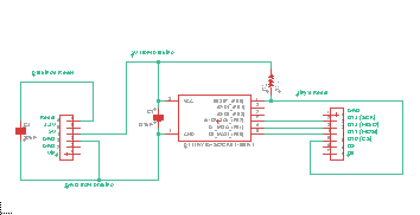
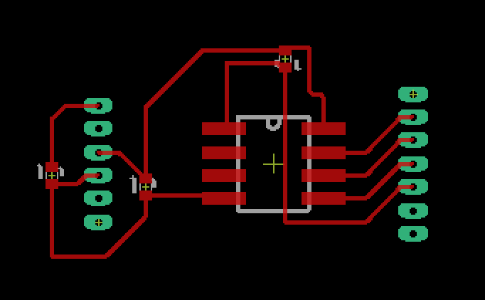
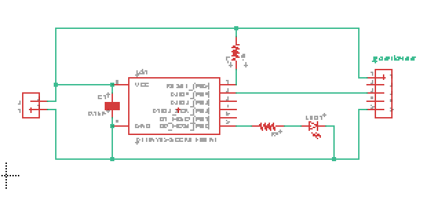
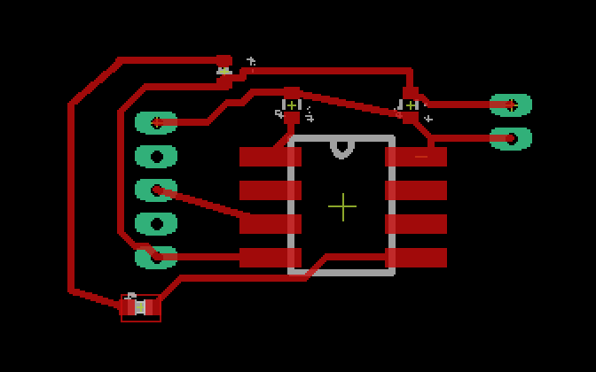
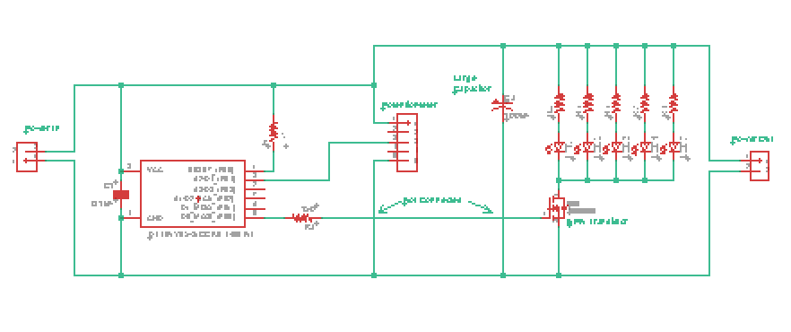
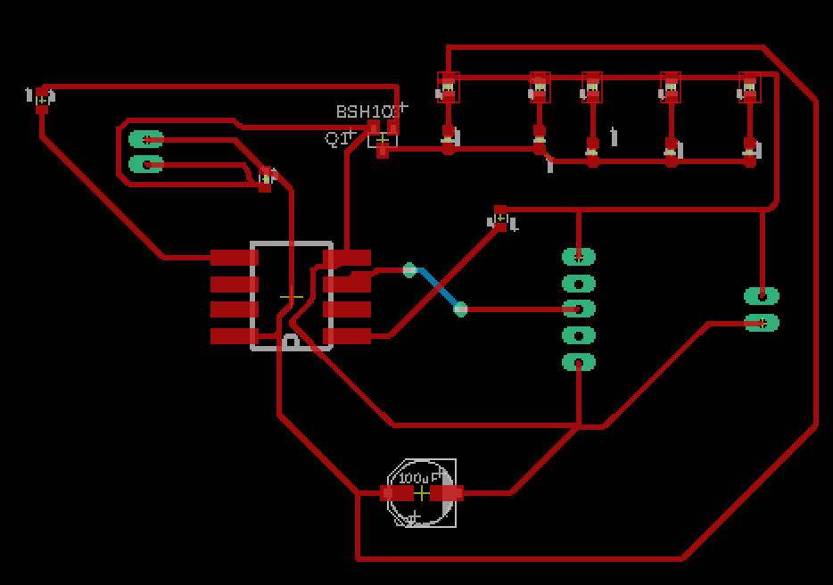

# Eagle Routing 

This homework is our first experience using the EAGLE software for the creation of PCB routing designs. 

We start with three different schematics and from that create .brd files which can be given to PCB mills in order to etch the routes onto a PCB board. While we haven't quite learned how to do that yet, this is the preliminary step and I am sure we will learn how to do this soon. 

#### ATTiny85 Programming Jig 

The first schematic we got was of the ATTiny85 Programming Jig just as we had created for our first week in-class exercise.

Here is the schematic file:

And here is my implementation of the routes for this schemeatic:

#### ATTiny85 LED 

The second schematic we got was of an ATTiny85 and LED setup. It seems this is just a very simple setup for controlling an LED with the ATTiny85

Here is the schematic file:

And here is my implementation of the routes for this schemeatic:

#### ATTiny85 Transistor 

The last schematic we got was of an ATTiny85 connected to a potentiometer and transistor. It seems to be a way for activating a larger power supply via the transistor to another electronic component. I am a little confused why a potentiometer is being used considering that is an analog switch and a transitor can only be off or on, but the professor said we will end up building this circuit board so I am sure we will find out. This one was defenitely the most difficult to figure out and I ended up needing to add a Via in order to finish the last connection. It is only one Via so it shouldn't be too difficult during the fabrication process and it gives me a chance to see what it takes to create a Via on a PCB board. 

Here is the schematic file:

And here is my implementation of the routes for this schemeatic:

