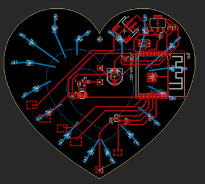

# Final Board - Capacitive Touch Heart

Okay so my final board ended up being a heart shaped board that has LEDs in the front in the shape of a heart along with a capacitive touch pad in the front. The LEDs are turned on when the capactive touch pad is pressed. I used a SMD ATtiny85 as the microcontroller and had wires soldered to the programming pins originally and just desoldered them after it had been programmed correctly. Here are pictures of the board along with the board design: 

Board and Schematic files can be found [here](https://github.com/boatshaman/HomemadeHardware/tree/master/Final%20Board/finschem) and the parts list has been updated in my [Final Project BOM](https://github.com/boatshaman/HomemadeHardware/tree/master/FinalProject_BOM). 

I think the coolest part about this board is that all the copper pours on the front are actually connected to the microcontroller. The outermost heart is the LED ground connected to the transistor, middle heart is vcc, innermost heart is the capacitive touch pad. Figuring out how to do the DXF files, polygon stuff, and connecting them to specific nets was a bit of a struggle but afterwards I got really quite good at using these features in EAGLE.

