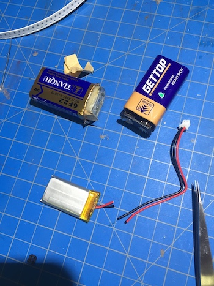
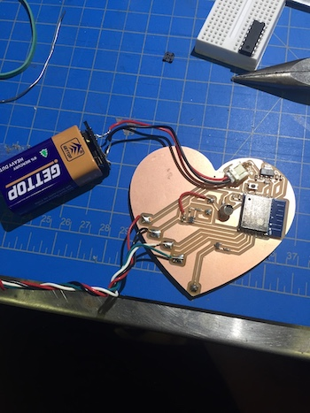

# Final Board - Capacitive Touch Heart

Okay so my final board ended up being a heart shaped board that has LEDs in the front in the shape of a heart along with a capacitive touch pad in the front. The LEDs are turned on when the capactive touch pad is pressed. I used a SMD ATtiny85 as the microcontroller and had wires soldered to the programming pins originally and just desoldered them after it had been programmed correctly. Here are pictures of the board along with the board design: 

Board and Schematic files can be found [here](https://github.com/boatshaman/HomemadeHardware/tree/master/Final%20Board/finschem) and the parts list has been updated in my [Final Project BOM](https://github.com/boatshaman/HomemadeHardware/tree/master/FinalProject_BOM). 

I think the coolest part about this board is that all the copper pours on the front are actually connected to the microcontroller. The outermost heart is the LED ground connected to the transistor, middle heart is vcc, innermost heart is the capacitive touch pad. Figuring out how to do the DXF files, polygon stuff, and connecting them to specific nets was a bit of a struggle but afterwards I got really quite good at using these features in EAGLE.

[Here](https://www.youtube.com/watch?v=mon0F_LehNs) is a video of the interaction 

I wanted to connect this board to a project I was creating for another class that would have it connected to the Adafruit IO MQTT broker. Originally I was planning on connecting some of the wires from the board to an ESP8266 Feather Huzzah I had but then realized that I could just put the ESP8266 on the heart itself! The generic ESP8266 is small enough and then I wouldn't be restricted to having the board connected to the microcontroller through wires. I redesigned the board with the ESP8266 as the controller. Here is the picture of the new board design:

There are two major changes in this. First is the ESP8266 of course. The ESP8266 is interesting because there are a couple pins that need to be correctly wired up for programming. DIO0 and DIO15 need to be pulled to ground and DIO2 to VCC. DIO0 usually needs to not be connected to ground though so I had add a button which I would press during programming. Another thing I needed for programming but didn't realize until after I had the board printed was I needed a connection from reset to the FTDI USB to serial programmer. It was really nerve wracking when I first tried to program the board after assembling it all and the code just wouldn't upload. I got around this but physically holding a wire to this pin during programming. 

I also forgot to connect one of the nets :'( 
I got around this buy soldering a wire to complete the connection. 

The final change that was neccessary was adding a regulator because the ESP8266 module excepts a maximum input voltage of 3.6 volts and even the lipo batteries give off a higher voltage when fully charged. As I wasn't able to order parts for this I just looked around the hard lab to find a regulator and settled on the UA78M33CDCYR 3.3v regulator. This was a mistake. While this regulator does give off 3.3v, it needs above a 5 volt input voltage which my lipo batteries wouldn't be able to provide. I realized this when I connected my lipo battery to the completed board and I measured the voltage coming out of the regulator to be about .3 volts. I was able to get around this by attaching a 9v battery to the board. I made a 9v battery connector by ripping apart an old 9v battery and soldering to the connectors of it. 

After that I just uploaded code and removed the programming wires and it was good to go! I needed rubber bands around the heart to secure the battery though. 

