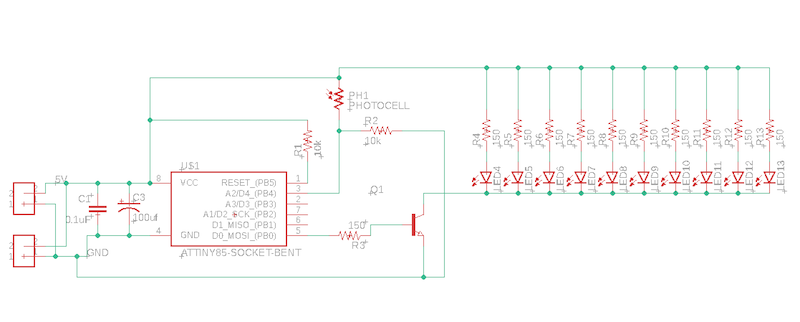
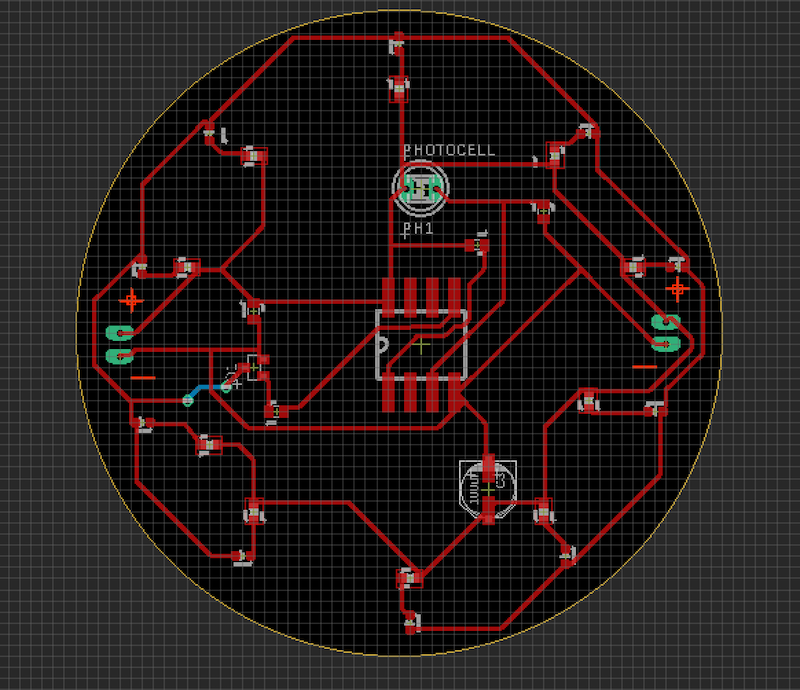
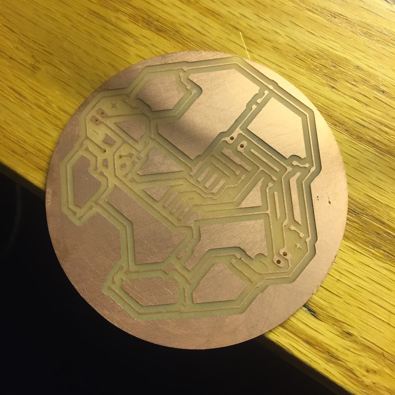
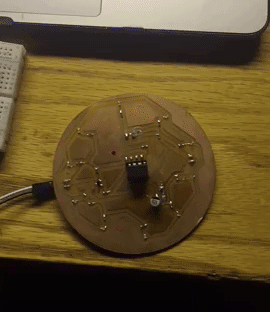

# Marquee Letter - O

This week we all were tasked with making a single letter in a Marquee sign. I was assigned the letter "O" and I attached a photoresistor onto the board to add an input element.

The hard part about this is we needed to make it completely from scratch. Design the schematic and circuit board on Eagle ([marquee.sch](eagle/marquee.sch) and [marquee.brd](eagle/marquee.brd) respectively), drill the board using Bantam and the Othermill PCB milling machines, add solder paste and SMD components by hand, solder additional parts on, and finally code an ATtiny 85 and stick it into the board. 

As my first time creating a circuit board from scratch I would say it went decently well. Here is the schematic: 

There is a transistor controlled by a pin on the ATtiny85 that when turned on connects the cathodes of all the LEDs to ground thus turning them on. There is a capacitor on the positive side of the LEDs to store up energy for use when its needed. Additionally, the photoresistor connects to an analog pin on the ATtiny85. 

And here is the circuit board I was able to create with this schematic:

After creating this design I needed to move onto the drilling using the othermill. This was my first time milling a PCB and getting used to the othermill was a very interesting experience. Switching drill bits is easily the most time consuming aspect of using these machines. 

I drilled the board and it came out looking good: 

I did forget to put a 3.3 mm hole in the board but I was able to drill it in after using a normal hand drill. 

After adding all the components, using a heat gun to solder the SMD components, and hand soldering the larger components and headers, my board seemed to not be working...

There were so many things that could have been wrong so I had no idea what the problem could be. The first thing I realized was that one of the LEDs was backwards, so I removed it from the board. Then I tried tried to make sure my ATtiny85 had been programmed correctly and was running. I did this by connecting it to a breadboard but was getting no response. It turned out I had forgot to gp to __sketch>upload using programmer__ after burning the bootloader. After fixing this it worked! I made the interaction simple but strong. Essentially when the lights turn off the lights on my letter will turn on. This is really dramatic if the lights in a room shut off but a sign turns on instantly. It worked pretty well too actually and i'm excited to see it connected to the other letters. 

