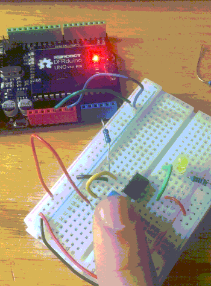

# ATtiny85 First Interaction

Our first assignment was to make a simple interactive system with the ATtiny85 acting as our microcontroller instead of, say, the Arduino Uno. 

This allows us to make our own interactive devices without the need to include a full comercial microcontroller and instead just make our own. 

I used the [programming rig](https://github.com/boatshaman/HomemadeHardware/tree/master/ATtiny85_Jig) that we created to upload simple arduino code which turned an LED on with the touch of a button. 

Here is a video of the simple interaction:

I was actually running into a lot of trouble with getting it to work at first and I thought I had actually broke my microcontroller. 

First thing I realized I needed to fix was I uploaded the test code to the Arduino to make sure my circuit worked, but forgot to reupload the ArduinoISP code to the Arduino Uno I was using to program the ATtiny85. This made it so I couldn't upload the code to the microcontroller. 

I fixed that, whew 😪, and was still having trouble getting code to run on the ATtiny85. I realized that instead of going to __Sketch > Upload Using Programmer__ I was doing __Tools > Burn Bootloader__

Once I realized this simple mistake everything worked as expected! 
