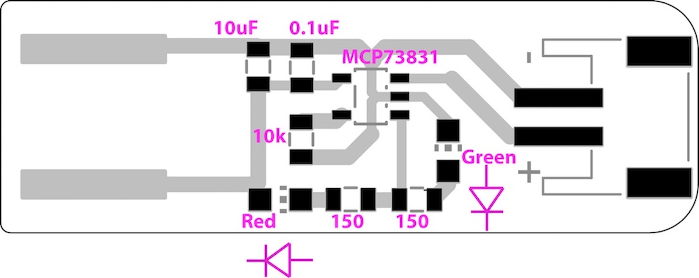
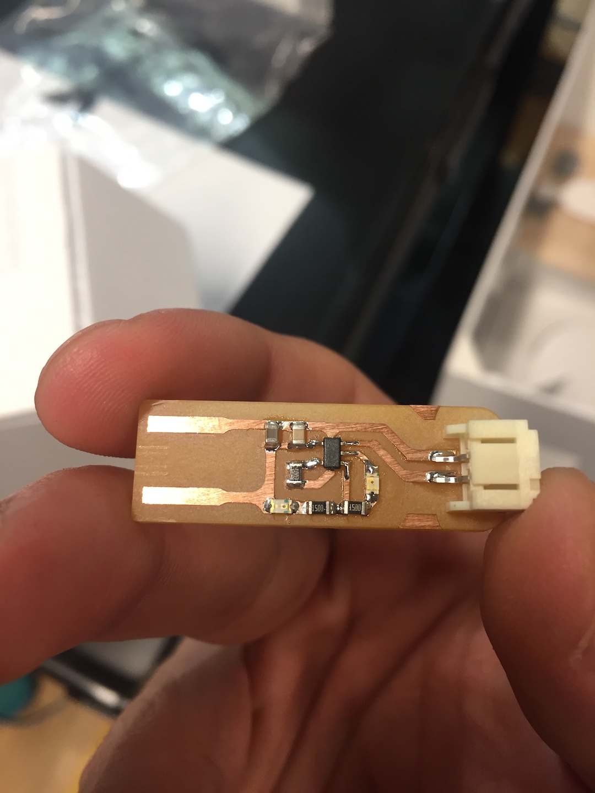
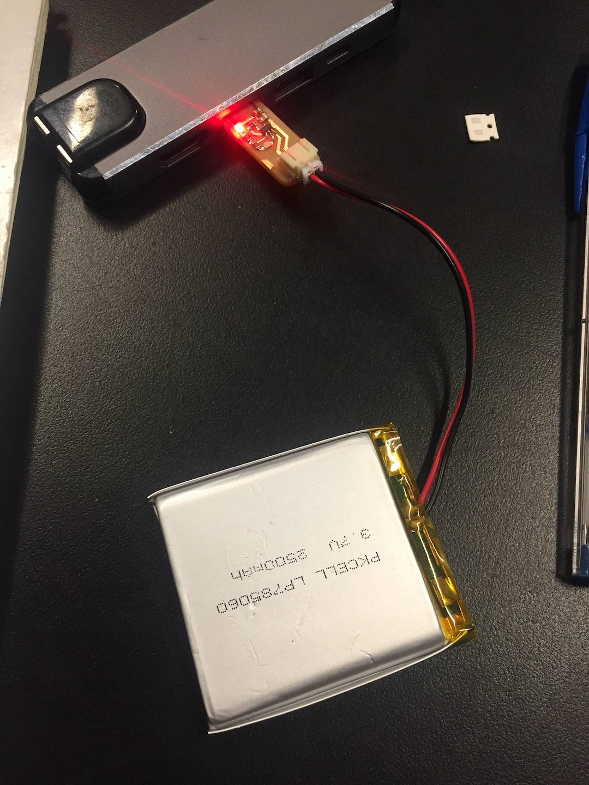

# LiPo Battery Charger Circuit Board - In class Exercise

This week in class we took the time to learn how to make circuit boards by hand! 

Seriously, this is super cool and I am very excited to try and make circuit boards for future projects with these techniques. 

### Materials:
* Green LED
* Red LED
* 10uf Capacitor
* .1uf Capacitor
* 150 ohm Resistor x 2
* 10k ohm Resistor
* [MCP73831](https://www.microchip.com/wwwproducts/en/en024903)
* PCB board (with routes already on it)
* Battery connector
* push pin
* solder paste

__(note: all these materials are much smaller than the parts I've used before to build cicruits because they are meant to sit directly on a printed circuit board)__
__(second note: there are two of each part in picture below because we did the process twice)__

### Process

Essentially what we needed to do is pick up solder paste with a push pin, place it on the locations where the parts needed to be connected to the board, and then place the board in the oven or use a heat gun to melt the solder and make the connections.

Here is a picture of the circuit board schematic:

For every black rectangle on the schematic we needed to add solder paste. It needed to be enough to make a solid connection but not too much that it became messy. 

For the first round we used tweezers to add all the components to their respective locations, which, while good practice and appropriate for our first time, was a rather painstaking process and is not feasible for large and compelex circuit boards. 

On our second round we got to use this really nifty vacuum which would pick up the parts for us easily, allowed easy rotation, and dropped the parts onto the board in a controlled manner as well. 

We then heat up the solder with either an oven or a heat gun and BOOM we get an awesome Lipo battery charger:

When the board is plugged in and no battery is plugged in, both lights will be on. 
When the board is plugged in and a battery is connected and charging the red light will be on. 
When the board is done charging the green light turns on.

Here is a picture of it charging:

