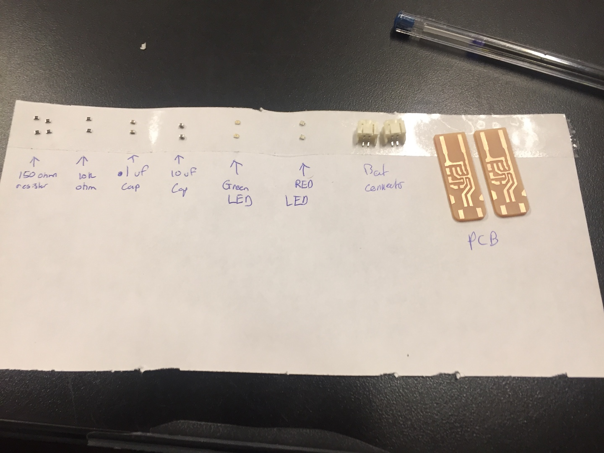

# LiPo Battery Charger Circuit Board - In class Exercise

This week in class we took the time to learn how to make circuit boards by hand! 

Seriously, this is super cool and I am very excited to try and make circuit boards for future projects with these techniques. 

### Materials:
* Green LED
* Red LED
* 10uf Capacitor
* .1uf Capacitor
* 150 ohm Resistor x 2
* 10k ohm Resistor
* [MCP73831](https://www.microchip.com/wwwproducts/en/en024903)
* PCB board (with routes already on it)
* Battery connector
* push pin
* solder paste

__(note: all these materials are much smaller than the parts I've used before to build cicruits because they are meant to sit directly on a printed circuit board)__

### Process

